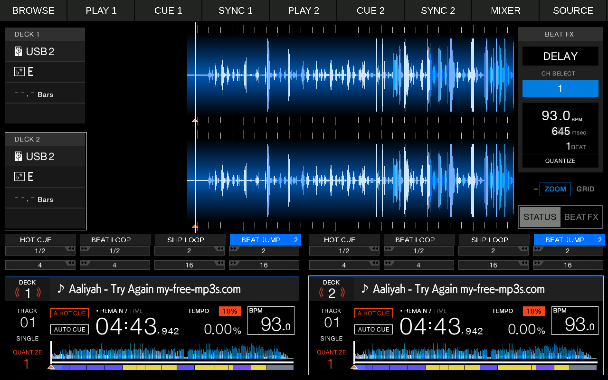

# FLX6 pad compatibility

The installed BiteDJ XML exposes deck1 hot cues on MIDI status0x97/notes0x00–07, beat jump on0x20–27, and beat loops on0x60–67. The bridge now tags hot-cue notes for native bank0 and default beat-jump notes for bank3. The native adapter selects and waits for the actual bank before forwarding a press. Beat-loop notes now select native bank1 before forwarding their pad presses. Generic native pad keys still follow the current bank; only the tagged FLX6 path adds this bank selection.

## Native bank selection

Live RX3 v1.19 state from `UiGetPadMode` / `StatWatcher::getPadMode`:

| Native key | First bank | Second bank |
|---|---:|---:|
| 0x4113 Hot Cue |0|4|
| 0x4114 Auto Beat Loop |1|5|
| 0x4115 Slip Loop |2|6|
| 0x4116 Beat Jump |3|7|

Selecting another family enters its first bank. Repeating its selector toggles between the first and second banks. The bridge must check actual bank state, select the intended bank, and wait for acknowledgment before forwarding a pad press. A cached last-sent mode is insufficient because native touch can change state independently. Do not blindly send the selector on every pad press.

Read-only native getter0x000fd3cc accepts zero-based deck index. It delegates to `StatWatcher::getPadMode`0x002c0464. For external diagnostics, root pointer0x02685f2c ->+56 watcher; watcher+12/+16 ->deck snapshot; byte+0x281 is pad mode. These addresses apply only to the verified binary.

## Beat Jump first bank

BiteDJ defaults and native bank3 agree:

| FLX6 note | Native pad key | Beats |
|---|---|---:|
|0x20|0x4117|-1|
|0x21|0x4118|+1|
|0x22|0x4119|-2|
|0x23|0x411a|+2|
|0x24|0x411b|-4|
|0x25|0x411c|+4|
|0x26|0x411d|-8|
|0x27|0x411e|+8|

With Aaliyah/Try Again at93 BPM, native forward/back tests measured ±645, ±1290, ±2580 and ±5160 milliseconds. Each backward pad returned to its paired forward trial's starting position. The same distances subsequently passed through the deployed FLX6 MIDI parser and bank-selection adapter on both decks, starting from wrong bank7 and repeating pads without toggling banks. Physical pad presses and timing while playing remain unverified. The second bank displays1/2 and16 beat pairs among its pads; it is not interchangeable with bank3.

BiteDJ's shifted size controls multiply/divide the entire jump bank by16, spanning fractional and large distances. They require additional native mapping; do not silently map them to an unrelated RX3 bank. Sampler and Pad FX also need separate compatibility work. LED feedback is not implemented.

## Beat Loop first bank

FLX6 notes0x60–67 map to native keys0x4117–0x411e in bank1: 1/4, 1/2, 1, 2, 4, 8, 16, 32 beats. Pressing the same pad again exits the loop. Deployed MIDI replay verified all eight sizes and on/off behavior on both decks, including automatic correction from bank5. A playing four-beat loop also wrapped at approximately2.58-second intervals at93BPM with active audio. Physical pad use remains unverified.

## Held MIDI pads

The reader tracks each held pad's native bank. A new bank press releases old-bank pads on that deck before requesting bank selection. A delayed old-bank NoteOff cannot release a new action occupying the same native pad key. Duplicate press packets for an already-held pad are ignored; disconnect cleanup clears pad ownership. This covers MIDI-originated overlap only: simultaneous native-touch/controller bank changes still need testing.

BiteDJ's `lights.*.*Mode` entries describe LED output addresses. The XML does not establish corresponding mode-button input mappings; do not infer an input handler from those LED constants alone. Actual mode-button input capture remains pending.

## Touchscreen mode selection

Each deck now has Hot Cue, Beat Loop, Slip Loop and Beat Jump buttons directly above its eight pads. Tap a different mode to select its first bank; tap the selected mode again to switch banks. Blue shows the selected mode and a `2` identifies its second bank. The highlight follows actual native state, including bank changes from MIDI. Mode selectors hide in Browse and while the mixer is open.

All four selectors and both banks were verified by touch replay on both decks. Touch-only Beat Jump forward/back and four-beat loop on/off also passed. Physical finger testing and the full set of secondary-bank pad actions remain pending.
